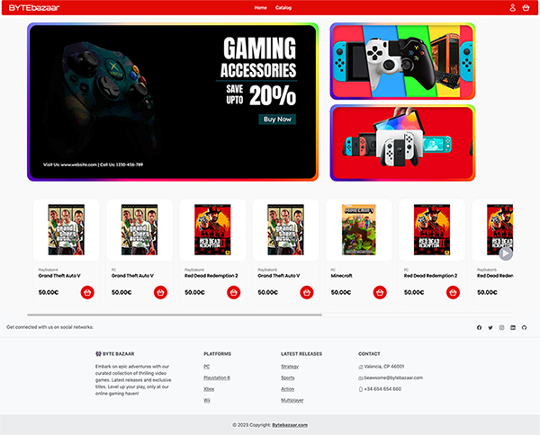
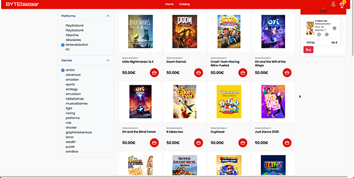
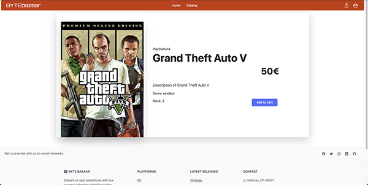
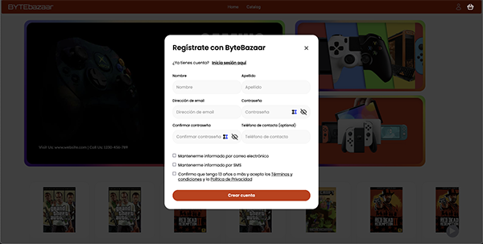

# ByteBazaar
This is the frontend for Byte Bazaar – online videogame store 👾

# Live Site
This site is live at https://byte-bazaar-git-develop-andreas-projects-912e5010.vercel.app/

# Views

## Homepage

## Catalog with sidebar and cart
Game catalog featuring a sidebar with filters by genre and platform. The shopping cart is visible on the corner with one added product.  

## Game detail

## Modal
The page features modals for Login, Register and Password Recovery. The one visible is for registration.  

